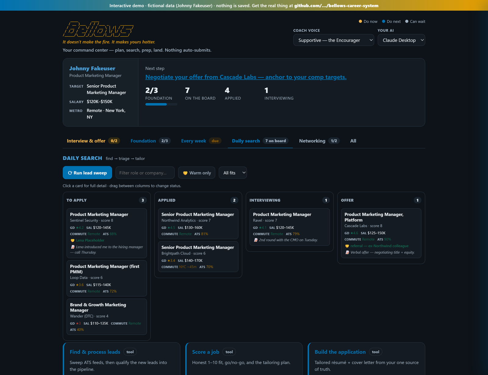

<p align="center">
  
</p>

# Bellows Career System

**An AI career coach and job-search copilot — honest role scoring, ATS-safe résumé
tailoring, interview prep, and salary negotiation, all from one profile. Human-in-the-loop:
it never auto-applies.**

<p align="center">
  
</p>

<p align="center"><em>The Career Hub, running on fictional demo data. Note the score-4 role it tells you to <strong>skip</strong>.</em></p>

> **Try it first —** open **[`starter/hub-demo.example.html`](starter/hub-demo.example.html)** in your
> browser for a fully interactive demo: kanban, detail drawer, filters, and drag-to-status, all working
> from fictional example data (Johnny Fakeuser). No install, no server, nothing saved.

## Contents

- [Try the demo](starter/hub-demo.example.html) — one self-contained HTML file, no install
- [What this is *not*](#what-this-is-not) — quality over volume, and why
- [Your data stays yours](#your-data-stays-yours) — the privacy model
- [Why Bellows](#why-bellows) — how it differs from the paid tools
- [Prerequisites](#prerequisites) — what to install first
- [First-time setup](#first-time-setup) — clone, scaffold, run
- [Layout](#layout) — what every file and folder is
- [Loops](#loops) — the day-to-day workflow
- [competitive-landscape.md](docs/competitive-landscape.md) — full market comparison + enhancement backlog
- [CONTRIBUTING.md](CONTRIBUTING.md) — dev setup, tests, and the automated quality gates

## What this is *not*

**This is not a high-volume application machine.** It will not fire off a hundred
résumés a week, and adding an auto-applier is explicitly out of scope. Mass-applying
is getting flagged as spam, and it doesn't work anyway — a generic application to a role
you're a 5 for is worse than no application, because it costs you the company.

**What it does instead is understand you first, then find fewer, better roles.**

1. **Who you are** — a career profile built by interview: your real scope, your metrics,
   your honest ceilings, and a blunt *"what I am NOT"* section that names the lanes you
   should skip.
2. **What you want, and why** — self-assessment and a 3-to-10-year roadmap anchored to the
   *why*, not just the next title. A plan up a ladder you don't want is a failure, however
   logical.
3. **Sourcing that matches that** — sweep company ATS feeds directly (not aggregators) for
   roles genuinely in your lane, then score each one honestly, out loud, gaps included.
4. **Depth on the few that survive** — tailor from one source of truth, route senior roles
   through a warm intro first, and prep the interview properly.

The scoring is designed to be *unflattering*. The demo ships with a role scored **4** and
labeled "don't apply," because a system that only produces 8s and 9s is telling you what you
want to hear, and you'll stop trusting it. **Ten well-matched applications beat two hundred
sprayed ones**, and the whole system is built around making those ten actually good.

## How it works

A human-in-the-loop career system. Two halves that feed each other:

- **Job search** — sweep company ATS feeds for in-lane roles, score them honestly
  against who you actually are, tailor résumés and cover letters from one source of
  truth, and track the pipeline on a local dashboard. **It never applies to anything
  for you** — you review and send every application.
- **Career coaching** — a 3-to-10-year roadmap from your profile, goal, and *why*:
  the honest gaps to close, the skills to acquire for the next step, and the kinds of
  jobs to watch for now. The coaching shapes what the search targets.

A local **Career Hub** (`bellows.bat` / `bellows.sh`) is the command center: it tracks
your progress, launches each step (copy a prompt into your AI, or run a one-shot via the
`claude`/`gemini` CLI), and lets you pick a **coach voice** — supportive, tough-love, zen,
humorous, or analytical (delivery only; the honest substance never changes).

## Your data stays yours

Everything personal lives in one gitignored folder, **`personal/`**:

```
personal/                 ← gitignored; your data never enters the repo
  userconfig.py           ← your settings (targets, companies, contact) — the one file you edit
  career-profile.md       ← your master career profile
  resume-style-rules.md   ← your résumé style rules — yours to customize
  applications/           ← tailored résumés & cover letters, per company
  reconnect-list.md       ← your warm network
  data/                   ← your live pipeline, jobs.json, leads
```

Everything else in the repo is generic machinery and safe to share. There is **no
build step** — the repo *is* the shareable product; `personal/` simply never gets
committed.

## Why Bellows

Most tools are point solutions — a résumé builder *or* a tracker *or* an interview coach *or* an
auto-applier. Bellows is the whole arc in one place, built on three choices the paid tools can't match:

- **Your data never leaves your machine.** Everything lives in the gitignored `personal/` folder — no
  SaaS server holds your résumé, history, or comp. (Salary-negotiation privacy is a documented concern.)
- **It never auto-applies.** Auto-appliers are getting flagged for spammy "human-impossible" velocity and
  hurt your reputation with generic submissions. Bellows scores fit honestly, tailors every
  application, routes senior roles through warm intros — and stops at the submit button.
- **It coaches the career, not just the application.** Self-assessment, a 3–10-year roadmap, positioning,
  negotiation anchored to *your* comp targets, and a first-90-days plan — not just "get the interview."

Runs on the Claude subscription you already have; the equivalent SaaS stack runs $60–200+/month across
four or five tools. Full market comparison + our enhancement backlog: **[competitive-landscape.md](docs/competitive-landscape.md)**.

## Prerequisites

You need three things before setup:

1. **Claude** — Bellows runs on Claude, using the subscription you already have (no per-application fees on top).
   - **Claude Code** or **Cowork** *(recommended)* — the agent has direct access to this folder and drives the
     whole system in place. This is by far the easiest path.
   - **Claude Desktop** (from [claude.ai](https://claude.ai)) — also works; you install the `*.skill` packages and
     paste prompts from the Hub.
2. **Git** — to clone the repo. (No Git? Download the ZIP from GitHub instead: **Code ▸ Download ZIP**, then unzip.)
3. **Python 3.10+** with `python-docx` — powers the sweep, the scorer, and the résumé/cover builders:
   ```
   python --version           # should be 3.10 or newer
   pip install python-docx
   ```

You'll run a couple of commands, so you also need a terminal — Windows PowerShell, the macOS/Linux Terminal, or
the one built into your editor. That's it; there's no database, account, or cloud service to set up.

## First-time setup

**On Claude Code or Cowork (recommended)?** Skip the manual steps — open/mount this folder and say
*"set up Bellows."* The agent runs `setup.py`, interviews you for your profile, runs the first sweep,
and updates the pipeline **in place** (what the skills call "folder mode"). Then just ask in plain language:
*"run a sweep and process the leads," "score this job: \[URL]," "who do I know at Stripe?," "prep me for my
interview at Acme."* The agent reads and writes `personal/` directly — your data never leaves the folder.
The rest of this section is the manual (Claude Desktop) path.

**Manual setup** — about an hour, mostly step 3:

0. **Get the folder.** Clone or download the repo and open it in Claude. Keep it a **private** repo if you
   push it anywhere (`personal/` is gitignored, but a private remote is the safe default).
   ```
   git clone https://github.com/YOUR-USERNAME/bellows-career-system.git
   cd bellows-career-system
   ```

1. **Scaffold your folder, then your settings.**
   ```
   python setup.py
   ```
   Creates your gitignored `personal/` folder from the starter templates (safe to re-run — it never
   overwrites your files) and seeds an empty pipeline so the Hub works on day one. Then edit
   `personal/userconfig.py`: who you are, your **current role**, your **target titles, lane, and industry**
   (these drive the sweep), your level and gates, target companies, and your **compensation** — current base,
   floor, target range, and hard walk-away (these drive negotiation and flag step-downs). It's the one file
   you edit — plain words, not regex.

   > **This is not a tech-jobs tool.** Every term the scorer matches on comes from your config, so it
   > searches whatever field you point it at. The template's sample values happen to describe a data
   > search, which makes two lists actively dangerous if you copy them unedited: **`NOISE` and
   > `OFF_CONTEXT` drop roles silently.** A recruiter would lose every result to `"recruiter"`, a
   > proposal manager to `"rfp"`. Edit those two before your first sweep.
   >
   > For a complete non-technical version, see **[`starter/userconfig.example.py`](starter/userconfig.example.py)** —
   > product marketing, and the companion to the worked profile in `starter/career-profile.example.md`.
   > It also shows how `LEVEL_AT_OR_ABOVE` inverts: for an IC reaching for Senior, "lead" and "principal"
   > are levels *above*, where in a director-level search the same words mean *below*.

2. **Install the skills.** Install the `*.skill` packages in `skills/` (Claude Desktop: Settings →
   Capabilities → add skill). `career-profile` and `voice-profile` run first.

3. **Build your profile** *(highest-leverage hour of the search)*. Say: *"Let's build my career profile —
   here are my resumes and LinkedIn."* The `career-profile` skill interviews you and writes
   `personal/career-profile.md`. Then `voice-profile` builds `personal/writing-style.md` from real samples of
   your writing. Every résumé, letter, and message is generated *from* these.

4. **First sweep, then open the Hub.**
   ```
   python engine/jobspy_sweep.py          # ATS-direct + boards -> personal/data/leads_*.csv
   ```
   Tell Claude *"leads have been updated, process them,"* then launch the **Career Hub** with `bellows.bat`
   (Windows) or `./bellows.sh` (Mac/Linux) — it runs the local server and opens `engine/hub.html`, your
   command center with progress, launchers, coach voice, and the full pipeline.

Read the `*.example.*` files in [`starter/`](starter/) first — the whole system filled in for a fictional
person (Johnny Fakeuser), including a role it says to *skip*. Seeing "good" takes five minutes and saves an hour
of staring at blank templates.

## Layout

| Path | What it is |
|---|---|
| `setup.py` | one-command scaffolder — builds `personal/` from the starter templates. Run first. |
| `personal/` | **all your data — gitignored.** userconfig, career profile, applications, reconnect list, data. |
| `config.py` | engine config loader — reads `personal/userconfig.py`, defines paths. Don't edit. |
| `engine/` | the tools: sweep, triage scorer, résumé/cover builders, `resume_score.py` (standalone 0–100 résumé health check), `ats_url.py` (company → ATS careers board), `server.py` (Hub app server), and the repeatable lead pipeline — `triage_leads.py` (dedupe new leads → worksheet) + `add_jobs_batch.py` (idempotent batch-add). `tools/test_links.py` checks every dashboard link. |
| `bellows.bat` / `bellows.sh` | launch the Career Hub (starts `server.py`, opens the browser). |
| `skills/` | the 13 Bellows skill packages: career-profile, voice-profile, self-assessment, positioning, career-coach (roadmap + weekly check-in), apply-pipeline (find + score), resume-tailor, network (reconnect + outreach + references), informational-interview, interview-prep (prep + follow-up), negotiation, linkedin-optimizer, first-90-days. |
| `engine/hub.html` | the **Career Hub** — the single surface: progress, coaching launchers, coach-voice selector, and the full job pipeline (kanban + detail drawer + lead sweep). |
| `engine/dashboard.html` | retired standalone board — the server 301-redirects it to the Hub (kept for reference). |
| `engine/coach-voice.md` | the 5 coach voices and when each works (delivery only). |
| `starter/` | blanks (`*.template.*`) to copy into `personal/`, a fully worked fictional example (`*.example.*`), and **`hub-demo.example.html`** — the self-contained interactive demo. |
| `starter/resume-style-rules.template.md` | style rules for generated documents — `setup.py` copies it to `personal/resume-style-rules.md`, yours to customize. |

## Loops

**Foundation (set once, revisit as you grow):**
```
"what do I actually want"          (self-assessment: values, strengths, motivators)
"what's my pitch / positioning"    (positioning: one-liner + 30s + 2-min, reused everywhere)
"help me plan my career"           (career-coach: goal + why → 3-10yr roadmap, gaps,
                                    skills to acquire, jobs to watch → updates the search targets)
```

**Every week:**
```
"weekly check-in"                  (career-coach: targets vs. actuals, blockers, next week)
```

**Networking (ongoing):**
```
"who should I talk to / coffee chat"  (informational-interview: learn + build advocates;
                                        network writes the message)
```

**Daily search:**
```
sweep → "process the leads"        (apply-pipeline: qualify new leads into the pipeline;
                                    triage_leads.py dedupes → you/agent score → add_jobs_batch.py)
paste a job → "score this"         (apply-pipeline: go/no-go + tailoring plan)
"build the application"            (engine/build_application.py from resume.json/cover.json)
"who do I know there?"             (network: the warm path — who, the message, references)
got an interview? "prep me"        (interview-prep: STAR story bank + per-role Qs + mock drill)
"thank-you / should I follow up?"  (interview-prep: timed thank-yous + nudges; network for references)
got an offer? "help me negotiate"  (negotiation: market + your userconfig comp targets)
landed it? "first 90 days plan"    (first-90-days: ramp that protects the move)
YOU review. YOU press send.
```

Nothing auto-submits.

## License & legal

Bellows is licensed under the **GNU Affero General Public License v3.0** — see [LICENSE](LICENSE).
In short: you're free to use, modify, and share it, but if you run a modified version as a network
service, you have to make your source available under the same license. That's deliberate. This system
is local-first by design, and the AGPL is what keeps a hosted, closed-source fork from becoming the
product.

**Job-board sweeps.** `engine/jobspy_sweep.py` queries public job boards through the third-party
[python-jobspy](https://github.com/speedyapply/JobSpy) library (defaults: Indeed and Google; others are
opt-in). Some job sites restrict automated access in their terms of service. **You are responsible for
using this tool in a way that complies with the terms of the sites you query**, and for the volume and
frequency of your own requests. It's built for one person running their own job search, not for scraping
at scale.

**No affiliation.** This project is not affiliated with, endorsed by, or connected to any job board, ATS
vendor, employer, or company named anywhere in this repository. Company, product, and ATS names are the
property of their respective owners and appear only to describe integrations or for comparison.

**No warranty.** Provided as-is, without warranty of any kind, as stated in the license. Nothing produced
by this system is legal, financial, or career advice — you review every application, and you press send.
