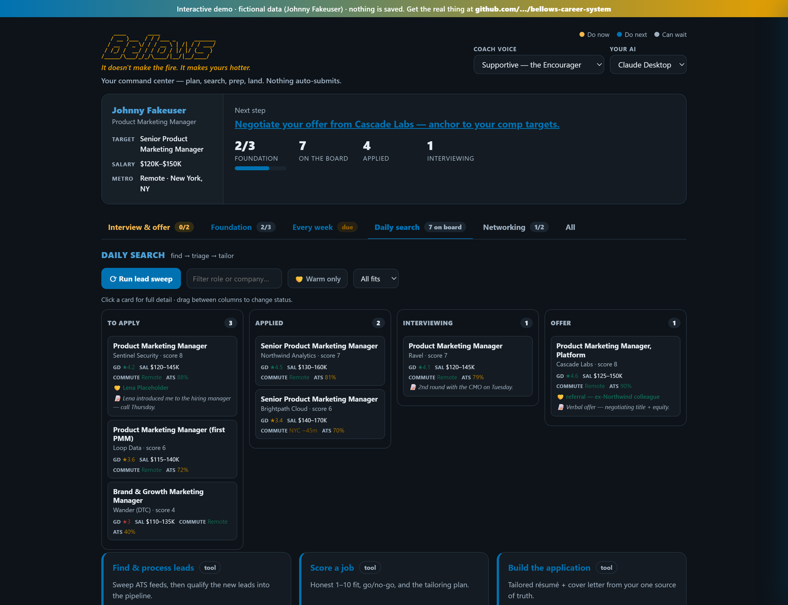

<p align="center">
  
</p>

# Bellows Career System

**An AI career coach and job-search copilot — honest role scoring, ATS-safe résumé
tailoring, interview prep, and salary negotiation, all from one profile. Human-in-the-loop:
it never auto-applies.**

<p align="center">
  <a href="https://jgobuilds.github.io/bellows-career-system/" title="Open the live, interactive demo">
    
  </a>
</p>

<p align="center">
  <strong><a href="https://jgobuilds.github.io/bellows-career-system/">▶ Click the screenshot to try it live</a></strong><br>
  <em>The real UI on fictional data — kanban, detail drawer, filters, drag-to-status. Nothing installed,
  nothing saved, nothing sent anywhere. Note the score-4 role it tells you to <strong>skip</strong>.</em>
</p>

## Contents

- [**Try the live demo**](https://jgobuilds.github.io/bellows-career-system/) — the real UI on fictional data, no install
- [What this is *not*](#what-this-is-not) — quality over volume, and why
- [The profile is the product](#the-profile-is-the-product) — the onboarding → source-of-truth → gap-fill loop
- [How it keeps the AI from making things up](#how-it-keeps-the-ai-from-making-things-up) — the enforced honesty checks
- [Your data stays yours](#your-data-stays-yours) — the privacy model
- [Why Bellows](#why-bellows) — how it differs from the paid tools
- [Prerequisites](#prerequisites) — what to install first
- [First-time setup](#first-time-setup) — clone, scaffold, run
- [Layout](#layout) — what every file and folder is
- [Loops](#loops) — the day-to-day workflow
- [Dependency and supply-chain security](#dependency-and-supply-chain-security) — what is watched, and what is not
- [competitive-landscape.md](docs/competitive-landscape.md) — full market comparison + enhancement backlog
- [CONTRIBUTING.md](CONTRIBUTING.md) — dev setup, tests, and the automated quality gates

## What this is *not*

**This is not a high-volume application machine.** It will not fire off a hundred
résumés a week, and adding an auto-applier is explicitly out of scope. Mass-applying
is getting flagged as spam, and it doesn't work anyway — a generic application to a role
you're a 5 for is worse than no application, because it costs you the company.

**What it does instead is understand you first, then find fewer, better roles.**

1. **Who you are** — a career profile built by interview: your real scope, your metrics,
   your honest ceilings, and a blunt *"what I am NOT"* section that names the lanes you
   should skip.
2. **What you want, and why** — self-assessment and a 3-to-10-year roadmap anchored to the
   *why*, not just the next title. A plan up a ladder you don't want is a failure, however
   logical.
3. **Sourcing that matches that** — sweep company ATS feeds directly (not aggregators) for
   roles genuinely in your lane, then score each one honestly, out loud, gaps included.
4. **Depth on the few that survive** — tailor from one source of truth, route senior roles
   through a warm intro first, and prep the interview properly.

The scoring is designed to be *unflattering*. The demo ships with a role scored **4** and
labeled "don't apply," because a system that only produces 8s and 9s is telling you what you
want to hear, and you'll stop trusting it. **Ten well-matched applications beat two hundred
sprayed ones**, and the whole system is built around making those ten actually good.

## The profile is the product

Most résumé tools start at the résumé. Bellows starts one step earlier, and that single
decision is what makes everything downstream honest.

<p align="center">
  
</p>

**Onboarding is an interview, not a form.** The `career-profile` skill asks about scope,
headcount, budget, real numbers, and the lanes you should *skip* — then writes
`personal/career-profile.md`. It takes about an hour, and it is the highest-leverage hour
of the search.

**Jobs reach the scoring step by two separate paths, and neither gets special treatment.**
The lead sweep polls company ATS feeds directly on a schedule you set, and anything you
find yourself is pasted straight in. Both land in the same scorer and get the same
unflattering 1–10.

**That file is then the only thing anything is generated from.** Every bullet, metric,
title, and skill in a résumé must trace back to it. The tailoring step matches a job
description's *vocabulary*, never its *claims*: if you didn't do the work, the keyword
doesn't go on, and the fit score says so out loud.

**When a document needs something the profile doesn't have, it asks you.** That is the
loop the diagram closes. A posting wants a metric you never recorded, or names a tool
you've touched but never wrote down — instead of guessing a plausible number, it stops
and asks in chat, and your answer is written back into the profile. Unknowns are flagged
in place as `[NEED METRIC]` and collected in the profile's **Metric gaps (open)** section,
and they're asked **in one batch rather than dripped one at a time**. Anything you don't
answer stays visibly marked, so a blank can't ship by accident.

The compounding effect is the point: **answer a question once and it is yours for good.**
The tenth application is faster and sharper than the first, because the profile absorbed
everything the previous nine surfaced. A tool that regenerates from scratch each time
learns nothing, and quietly invents the gaps.

## How it keeps the AI from making things up

An LLM writing your résumé will invent a plausible number if you let it, and a plausible
number on a résumé is a landmine: it survives the screen and detonates in the interview or
the reference check. So the honesty rules aren't left to the model's good intentions — they
are enforced by code that runs on every build.

**One source of truth.** Every bullet, metric, title, and tool must trace to
`career-profile.md`. Nothing is generated from the job description, and matching a posting's
*vocabulary* is never license to adopt its *claims*.

**Gaps are asked, not filled.** When a document needs something the profile lacks, the system
stops and asks you in chat. Unknowns are flagged in place as `[NEED METRIC]` and collected in
the profile's **Metric gaps (open)** section; anything you don't answer stays visibly marked,
so a blank can't ship by accident.

**Build-time spec validation** (`resume_builder.validate`) — every build prints warnings for:

| Check | Catches |
|---|---|
| `employer_tool_warnings()` | a tool credited to the **wrong employer** — the profile's per-employer tool list is the authority, so "Snowflake" on an employer where you ran BigQuery is flagged even though the tool is genuinely yours elsewhere |
| `scan_placeholders()` | unresolved `[LIKE THIS]` placeholders left in the text |
| title / location format | punctuation and layout that silently truncate on ATS import |

**The keyword checker refuses to pad.** `ats_match.py` reports coverage against the real job
description and lists what's missing — then says outright that a term you can't back up does
not go on the résumé to clear a threshold. A lower score is the correct outcome when the
alternative is a claim you can't defend.

**Unquantified bullets are surfaced, not invented.** `resume_score.py` flags every bullet
with no number so *you* can supply a real one or cut it. It never supplies one.

**The profile carries its own guardrails.** Facts that are easy to overstate are annotated at
the source — figures that must not be summed, per-tool counts that overlap the same people,
illustrative examples that aren't averages, planned results that haven't landed. The
annotations travel with the fact, so they're in front of you when you're drafting *and* when
you're answering questions about it.

**Nothing auto-submits.** The last check is you.

**What this can't do.** These are nets, not walls. They catch misattribution, padding, and
unsupported numbers; they cannot verify that what's in your profile is true in the first
place, and they don't read tone or judge whether a framing is fair. The system is built to
make the honest path the easy one, not to remove you from it.

## How it works

A human-in-the-loop career system. Two halves that feed each other:

- **Job search** — sweep company ATS feeds for in-lane roles, score them honestly
  against who you actually are, tailor résumés and cover letters from one source of
  truth, and track the pipeline on a local dashboard. **It never applies to anything
  for you** — you review and send every application.
- **Career coaching** — a 3-to-10-year roadmap from your profile, goal, and *why*:
  the honest gaps to close, the skills to acquire for the next step, and the kinds of
  jobs to watch for now. The coaching shapes what the search targets.

A local **Career Hub** (`bellows.bat` / `bellows.sh`) is the command center: it tracks
your progress, launches each step (copy a prompt into your AI, or run a one-shot via the
`claude`/`gemini` CLI), and lets you pick a **coach voice** — supportive, tough-love, zen,
humorous, or analytical (delivery only; the honest substance never changes).

## Your data stays yours

Everything personal lives in one gitignored folder, **`personal/`**:

```
personal/                 ← gitignored; your data never enters the repo
  userconfig.py           ← your settings (targets, companies, contact) — the one file you edit
  career-profile.md       ← your master career profile
  resume-style-rules.md   ← your résumé style rules — yours to customize
  applications/           ← tailored résumés & cover letters, per company
  reconnect-list.md       ← your warm network
  data/                   ← your live pipeline, jobs.json, leads
```

Everything else in the repo is generic machinery and safe to share. There is **no
build step** — the repo *is* the shareable product; `personal/` simply never gets
committed.

### Backing it up

The gitignore is why `personal/` needs a backup, not a substitute for one. Every
commit here is replicated to GitHub; `personal/` exists on exactly one disk.

```bash
python engine/backup_personal.py
```

That writes a dated, verified `.zip` to the folder you set as `BACKUP_DIR` in
`userconfig.py` — a cloud-synced one, typically OneDrive or Google Drive. Leave the
setting blank and it looks for one under your home directory and proposes a path.

| | |
|---|---|
| `--dry-run` | list what would go in, write nothing |
| `--full` | include the rendered `.docx`/`.pdf` too |
| `--list` | what is already backed up |
| `--verify` | re-extract the newest archive and re-hash every file |
| `--restore <zip> --into <dir>` | put it back |
| `--where` | which cloud folders on this machine are actually linked |
| `--allow-local` | accept a destination nothing is uploading |
| `--schedule [DAY] --at HH:MM` | install a weekly run (Windows; default Sunday 09:00) |
| `--schedule-status` | is it installed, and how did the last run go |
| `--unschedule` | remove the scheduled run; archives are untouched |

**It captures sources, not outputs.** Most of `personal/` by size is generated
documents, and each one rebuilds from a `.json` spec a fraction of its size, so the
default skips them and the archive comes out around a megabyte. Run `--full`
occasionally anyway: a document you actually submitted is a record of what you sent,
which is not quite the same as one you could regenerate.

**Archives are dated, not synced.** Sync is not backup. If something truncates
`jobs.json`, a sync folder replicates the truncation within seconds and the good copy
is gone from both ends; yesterday's archive is a separate object that nothing is
propagating into.

**Restoring is an extract into the repo root.** Paths inside are repo-relative and
every archive carries a `RESTORE.md` explaining itself, so an archive found years
later without this README is still usable. `--restore` refuses to overwrite existing
files unless you pass `--force`.

**A scheduled run writes a log.** `--schedule` installs a weekly Windows task that
appends every run to `personal/data/backup.log`, and `--schedule-status` reads it
back. A weekly backup is exactly the thing that fails quietly for two months — the
destination unmounts, a drive letter moves, the disk fills — so the last outcome has
to be a question with an answer. Note that Task Scheduler's own "Last Result: 0" only
means it launched the wrapper, not that the backup worked; the log is the truth.

**It checks that the destination is really syncing.** A folder named `OneDrive` is not
OneDrive — Windows creates that folder during setup whether or not anyone ever signs
in, so writing there succeeds, reports success, and uploads nothing. The tool reads
the sync client's own configuration instead of trusting the folder name, and stops
with exit 3 if the destination is a dead cloud folder or a plain local directory.
`--where` shows what is actually linked; `--allow-local` accepts a second physical
disk if that is genuinely what you meant, which protects against a failed drive but
not against losing the machine.

The archive is entirely personal data, so the tool **refuses a destination inside the
repo** rather than trusting a gitignore to hold. If you want encryption at rest or
real snapshot history, use [restic](https://restic.net/) against `personal/` instead
— this is the small, legible option, not the most capable one.

## Why Bellows

Most tools are point solutions — a résumé builder *or* a tracker *or* an interview coach *or* an
auto-applier. Bellows is the whole arc in one place, built on three choices the paid tools can't match:

- **Your data never leaves your machine.** Everything lives in the gitignored `personal/` folder — no
  SaaS server holds your résumé, history, or comp. (Salary-negotiation privacy is a documented concern.)
- **It never auto-applies.** Auto-appliers are getting flagged for spammy "human-impossible" velocity and
  hurt your reputation with generic submissions. Bellows scores fit honestly, tailors every
  application, routes senior roles through warm intros — and stops at the submit button.
- **It coaches the career, not just the application.** Self-assessment, a 3–10-year roadmap, positioning,
  negotiation anchored to *your* comp targets, and a first-90-days plan — not just "get the interview."
- **One profile, and it compounds.** Everything generates from `career-profile.md`, and when a document
  needs something the profile lacks, it asks you and writes the answer back — so the tenth application is
  sharper than the first. See [the profile loop](#the-profile-is-the-product). A generator with no
  persistent profile behind it has nowhere to put what it learns, so it starts from zero every time.

Runs on the Claude subscription you already have; the equivalent SaaS stack runs $60–200+/month across
four or five tools. Full market comparison + our enhancement backlog: **[competitive-landscape.md](docs/competitive-landscape.md)**.

## Prerequisites

You need three things before setup:

1. **Claude** — Bellows runs on Claude, using the subscription you already have (no per-application fees on top).
   - **Claude Code** or **Cowork** *(recommended)* — the agent has direct access to this folder and drives the
     whole system in place. This is by far the easiest path.
   - **Claude Desktop** (from [claude.ai](https://claude.ai)) — also works; you install the `*.skill` packages and
     paste prompts from the Hub.
2. **Git** — to clone the repo. (No Git? Download the ZIP from GitHub instead: **Code ▸ Download ZIP**, then unzip.)
3. **Python 3.10+** with `python-docx` — powers the sweep, the scorer, and the résumé/cover builders:
   ```
   python --version           # should be 3.10 or newer
   pip install python-docx
   ```

You'll run a couple of commands, so you also need a terminal — Windows PowerShell, the macOS/Linux Terminal, or
the one built into your editor. That's it; there's no database, account, or cloud service to set up.

## First-time setup

**On Claude Code or Cowork (recommended)?** Skip the manual steps — open/mount this folder and say
*"set up Bellows."* The agent runs `setup.py`, interviews you for your profile, runs the first sweep,
and updates the pipeline **in place** (what the skills call "folder mode"). Then just ask in plain language:
*"run a sweep and process the leads," "score this job: \[URL]," "who do I know at Stripe?," "prep me for my
interview at Acme."* The agent reads and writes `personal/` directly — your data never leaves the folder.
The rest of this section is the manual (Claude Desktop) path.

**Manual setup** — about an hour, mostly step 3:

0. **Get the folder.** Clone or download the repo and open it in Claude. Keep it a **private** repo if you
   push it anywhere (`personal/` is gitignored, but a private remote is the safe default).
   ```
   git clone https://github.com/YOUR-USERNAME/bellows-career-system.git
   cd bellows-career-system
   ```

1. **Scaffold your folder, then your settings.**
   ```
   python setup.py
   ```
   Creates your gitignored `personal/` folder from the starter templates (safe to re-run — it never
   overwrites your files) and seeds an empty pipeline so the Hub works on day one. Then edit
   `personal/userconfig.py`: who you are, your **current role**, your **target titles, lane, and industry**
   (these drive the sweep), your level and gates, target companies, and your **compensation** — current base,
   floor, target range, and hard walk-away (these drive negotiation and flag step-downs). It's the one file
   you edit — plain words, not regex.

   > **This is not a tech-jobs tool.** Every term the scorer matches on comes from your config, so it
   > searches whatever field you point it at. The template's sample values happen to describe a data
   > search, which makes two lists actively dangerous if you copy them unedited: **`NOISE` and
   > `OFF_CONTEXT` drop roles silently.** A recruiter would lose every result to `"recruiter"`, a
   > proposal manager to `"rfp"`. Edit those two before your first sweep.
   >
   > For a complete non-technical version, see **[`starter/userconfig.example.py`](starter/userconfig.example.py)** —
   > product marketing, and the companion to the worked profile in `starter/career-profile.example.md`.
   > It also shows how `LEVEL_AT_OR_ABOVE` inverts: for an IC reaching for Senior, "lead" and "principal"
   > are levels *above*, where in a director-level search the same words mean *below*.

2. **Install the skills.** Install the `*.skill` packages in `skills/` (Claude Desktop: Settings →
   Capabilities → add skill). `career-profile` and `voice-profile` run first.

3. **Build your profile** *(highest-leverage hour of the search)*. Say: *"Let's build my career profile —
   here are my resumes and LinkedIn."* The `career-profile` skill interviews you and writes
   `personal/career-profile.md`. Then `voice-profile` builds `personal/writing-style.md` from real samples of
   your writing. Every résumé, letter, and message is generated *from* these.

4. **First sweep, then open the Hub.**
   ```
   python engine/jobspy_sweep.py          # ATS-direct + boards -> personal/data/leads_*.csv
   ```
   Tell Claude *"leads have been updated, process them,"* then launch the **Career Hub** with `bellows.bat`
   (Windows) or `./bellows.sh` (Mac/Linux) — it runs the local server and opens `engine/hub.html`, your
   command center with progress, launchers, coach voice, and the full pipeline.

Read the `*.example.*` files in [`starter/`](starter/) first — the whole system filled in for a fictional
person (Johnny Fakeuser), including a role it says to *skip*. Seeing "good" takes five minutes and saves an hour
of staring at blank templates.

## Layout

| Path | What it is |
|---|---|
| `setup.py` | one-command scaffolder — builds `personal/` from the starter templates. Run first. |
| `personal/` | **all your data — gitignored.** userconfig, career profile, applications, reconnect list, data. |
| `config.py` | engine config loader — reads `personal/userconfig.py`, defines paths. Don't edit. |
| `engine/` | the tools: sweep, triage scorer, résumé/cover builders, `resume_score.py` (standalone 0–100 résumé health check), `ats_url.py` (company → ATS careers board), `server.py` (Hub app server), and the repeatable lead pipeline — `triage_leads.py` (dedupe new leads → worksheet) + `add_jobs_batch.py` (idempotent batch-add). `tools/test_links.py` checks every dashboard link. |
| `bellows.bat` / `bellows.sh` | launch the Career Hub (starts `server.py`, opens the browser). |
| `.claude/skills/` | **source** for the 13 Bellows skills — edit here |
| `skills/` | **generated** `.skill` packages you install (`python tools/build_skills.py` rebuilds them): career-profile, voice-profile, self-assessment, positioning, career-coach (roadmap + weekly check-in), apply-pipeline (find + score), resume-tailor, network (reconnect + outreach + references), informational-interview, interview-prep (prep + follow-up), negotiation, linkedin-optimizer, first-90-days. |
| `engine/hub.html` | the **Career Hub** — the single surface: progress, coaching launchers, coach-voice selector, and the full job pipeline (kanban + detail drawer + lead sweep, sweep freshness + recommended cadence, work-authorization flags). |
| `engine/sweep_schedule.py` | registers the sweep with **Windows Task Scheduler** so it runs when the Hub is closed. User-scope task, no admin; warns if another task already runs a sweep. Non-Windows gets the equivalent cron line. |
| `engine/cadence.py` | infers each company's posting rhythm from a single board fetch and recommends when the next sweep is worth running. |
| `engine/work_auth.py` | reads a posting's sponsorship / citizenship terms and flags only what conflicts with *your* status. Never written into a résumé or cover letter. |
| `engine/dashboard.html` | retired standalone board — the server 301-redirects it to the Hub (kept for reference). |
| `engine/coach-voice.md` | the 5 coach voices and when each works (delivery only). |
| `starter/` | blanks (`*.template.*`) to copy into `personal/`, a fully worked fictional example (`*.example.*`), and **`hub-demo.example.html`** — the self-contained interactive demo. |
| `starter/resume-style-rules.template.md` | style rules for generated documents — `setup.py` copies it to `personal/resume-style-rules.md`, yours to customize. |

## Loops

**Foundation (set once, revisit as you grow):**
```
"what do I actually want"          (self-assessment: values, strengths, motivators)
"what's my pitch / positioning"    (positioning: one-liner + 30s + 2-min, reused everywhere)
"help me plan my career"           (career-coach: goal + why → 3-10yr roadmap, gaps,
                                    skills to acquire, jobs to watch → updates the search targets)
```

**Every week:**
```
"weekly check-in"                  (career-coach: targets vs. actuals, blockers, next week)
```

**Networking (ongoing):**
```
"who should I talk to / coffee chat"  (informational-interview: learn + build advocates;
                                        network writes the message)
```

**Daily search:**
```
sweep → "process the leads"        (apply-pipeline: qualify new leads into the pipeline;
                                    triage_leads.py dedupes → you/agent score → add_jobs_batch.py)
                                   the Hub shows when you last swept and when the boards'
                                   own posting rhythm says the next one is worth running —
                                   and can register it with Windows Task Scheduler for you
paste a job → "score this"         (apply-pipeline: go/no-go + tailoring plan)
"build the application"            (engine/build_application.py from resume.json/cover.json)
"who do I know there?"             (network: the warm path — who, the message, references)
got an interview? "prep me"        (interview-prep: STAR story bank + per-role Qs + mock drill)
"thank-you / should I follow up?"  (interview-prep: timed thank-yous + nudges; network for references)
got an offer? "help me negotiate"  (negotiation: market + your userconfig comp targets)
landed it? "first 90 days plan"    (first-90-days: ramp that protects the move)
YOU review. YOU press send.
```

Nothing auto-submits.

## Dependency and supply-chain security

The runtime surface here is deliberately small — the ATS-direct sweep, the local
server, and the pipeline tools are **stdlib-only**. Two third-party packages carry
real weight: `python-docx` (document generation) and `python-jobspy` (the board
sweep, which is also the only component that talks to the outside world).

| Control | Covers |
|---|---|
| **Dependabot**, daily (`.github/dependabot.yml`) | declared `pip` dependencies and the GitHub Actions used by CI |
| **CI quality gate** (`.github/workflows/quality.yml`) | lint, format, types, and tests on every push and PR |
| **PII pre-commit gate** | personal data in staged files, before it can enter history |
| **PII commit-message gate** | personal data in the commit *message*, which no file-level control sees |

**Daily, not weekly, on purpose.** The 2026 pattern is CVEs exploited within about
36 hours of disclosure, so a weekly cadence can leave a known-exploited flaw
sitting for six days. Noise stays bounded by `open-pull-requests-limit`.

**Pinning without an update process is worse than floating.** A scanner tells you
a dependency is vulnerable; Dependabot opens the PR that fixes it. Both halves are
needed — see [`ai-standards/references/dependency-security.md`](https://github.com/jgobuilds/ai-standards/blob/main/references/dependency-security.md).

### What this does not cover

Stated plainly, because a security section that only lists wins is worse than none:

- **Vulnerability scanning does not run in CI.** Dependabot raises alerts on
  GitHub's side; nothing in `quality.yml` fails a build on a known CVE. A push with
  a vulnerable pinned dependency goes green.
- **Coverage is of *declared* dependencies.** `requirements.txt` is what gets
  watched. Whatever pip resolves transitively underneath is only covered insofar as
  Dependabot's graph sees it.
- **No image scanning, because there are no images.** This repo ships no
  containers; there is no built artifact whose final layers could carry
  transitively-installed content. A project that *does* build images needs that
  scan separately — base-image and declared-dependency coverage does not reach
  content installed into the final layers.
- **No runtime egress control.** `python-jobspy` reaches public job boards by
  design. You are responsible for the volume and frequency of your own requests
  (see License & legal).

## License & legal

Copyright © 2026 Brightside Data LLC. Bellows is licensed under the **GNU Affero General Public
License v3.0** — see [LICENSE](LICENSE).
In short: you're free to use, modify, and share it, but if you run a modified version as a network
service, you have to make your source available under the same license. That's deliberate. This system
is local-first by design, and the AGPL is what keeps a hosted, closed-source fork from becoming the
product.

**Job-board sweeps.** `engine/jobspy_sweep.py` queries public job boards through the third-party
[python-jobspy](https://github.com/speedyapply/JobSpy) library (defaults: Indeed and Google; others are
opt-in). Some job sites restrict automated access in their terms of service. **You are responsible for
using this tool in a way that complies with the terms of the sites you query**, and for the volume and
frequency of your own requests. It's built for one person running their own job search, not for scraping
at scale.

**No affiliation.** This project is not affiliated with, endorsed by, or connected to any job board, ATS
vendor, employer, or company named anywhere in this repository. Company, product, and ATS names are the
property of their respective owners and appear only to describe integrations or for comparison.

**No warranty.** Provided as-is, without warranty of any kind, as stated in the license. Nothing produced
by this system is legal, financial, or career advice — you review every application, and you press send.

---

**Bellows, by [JGOBuilds](https://github.com/jgobuilds).** Copyright © 2026 Brightside Data LLC.
